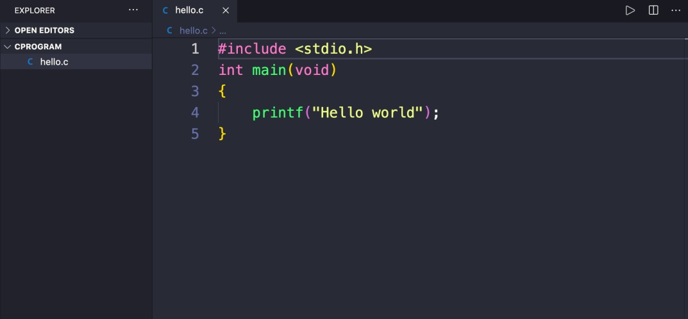

# C - Programming

This repository contains solutions to various programming tasks and projects focusing on the C programming language. Each task is designed to improve understanding and proficiency in C programming concepts.

## Resources
Everything you need to know to start with C.pdf
Dennis Ritchie
"C" Programming Language: Brian Kernighan
Why C Programming Is Awesome
Learning to program in C part 1
Learning to program in C part 2
Understanding C program Compilation Process
Betty Coding Style
Hash-bang under the hood
Linus Torvalds on C vs. C++
## Learning Objectives
At the end of this project, you will be able to explain the following concepts without relying on external resources:

Why C programming is awesome
The inventors of C: Dennis Ritchie, Brian Kernighan, and Linus Torvalds
Compilation process with gcc
Usage of printf, puts, and putchar
Unary operator sizeof
Compilation using gcc
C coding style with betty
Header inclusion in C programs
Influence of main function on program return value
